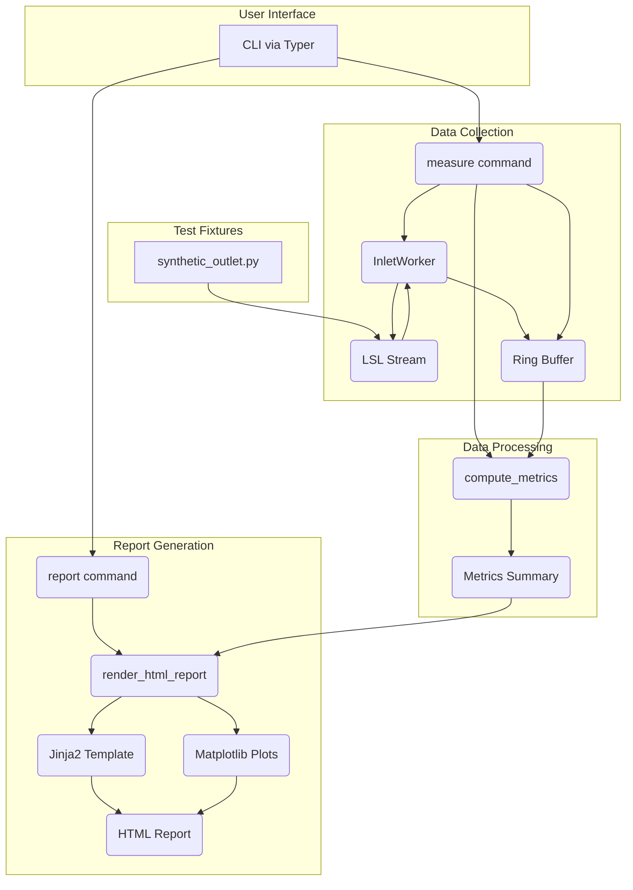

```mermaid
graph TD
    subgraph "User Interface"
        A[CLI via Typer]
    end

    subgraph "Test Fixtures"
        SO[synthetic_outlet.py]
    end

    subgraph "Data Collection"
        B(measure command)
        C(InletWorker)
        D(LSL Stream)
        E(Ring Buffer)
    end

    subgraph "Data Processing"
        F(compute_metrics)
        G(Metrics Summary)
    end

    subgraph "Report Generation"
        H(report command)
        I(render_html_report)
        J(Jinja2 Template)
        K(Matplotlib Plots)
        L(HTML Report)
    end

    A --> B
    A --> H

    SO --> D

    B --> C
    C --> D
    D --> C
    C --> E
    B --> E

    B --> F
    E --> F
    F --> G

    H --> I
    G --> I
    I --> J
    I --> K
    J --> L
    K --> L
```